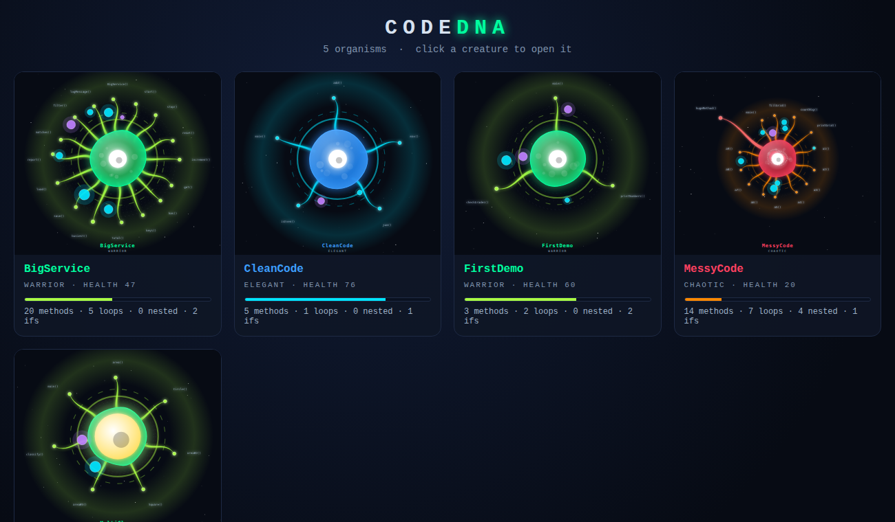
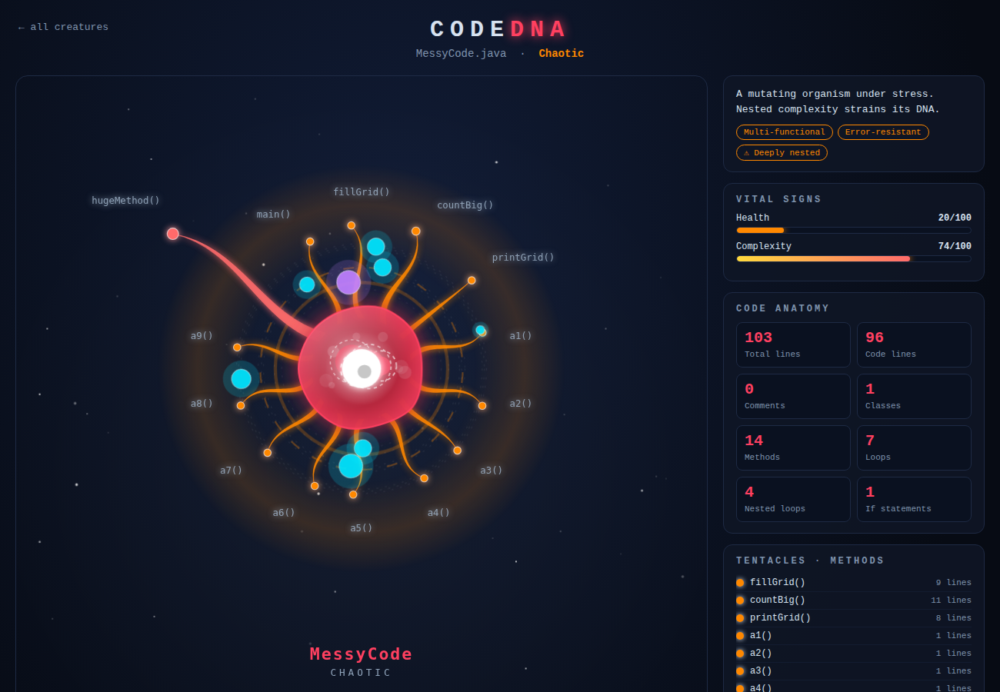

# CodeDNA — Biomorphic Code Visualization Engine

> *Your code, alive. Every method a tentacle. Every nested loop a tumour.*

CodeDNA is a pure-Java tool that reads any `.java` source file and turns its structure into a
living, animated **organism** shown in your web browser. The shape, colour, size and behaviour of
the creature come directly from the code: two different files always produce two different
creatures, and the same file always produces the same creature.



**Pure Java · zero libraries · zero database · output is plain HTML + SVG + CSS**

---

## 1. Features

- Parses classes, methods, loops, nested loops, `if` statements, `try` blocks, imports and comments.
- Ignores keywords that appear inside comments or string literals.
- Maps code metrics to creature features (see the table in section 3).
- Animated SVG: waving tentacles, morphing and pulsing body, orbiting cells, heart-beating nucleus,
  throbbing tumours, breathing aura.
- A dark sci-fi HTML page per file with vital-sign bars, code statistics, method list and legend.
- Processes one file, several files, or a whole folder — folders also get a gallery page.
- Opens the result in your default browser automatically.
- Saves a stand-alone `.svg` of every creature.
- Built-in self-test (47 checks) with no test library needed.



---

## 2. How it works — the pipeline

| Step | Class | What it does |
|------|-------|--------------|
| 1 | `ASTParser` | Reads the file line by line and measures its structure (`CodeMetrics`). |
| 2 | `CreatureGenerator` | Converts the metrics into creature data: body, tentacles, cells, tumours, colours. |
| 3 | `SVGBuilder` | Draws the creature as an animated SVG. |
| 4 | `HTMLExporter` | Wraps the SVG in an HTML page (and builds the gallery page). |
| — | `Main` | Entry point: runs steps 1–4 for every input file and opens the browser. |
| — | `SelfTest` | Automated checks for the parser, the mapping, the output files and error handling. |

```
 .java file ──► ASTParser ──► CreatureGenerator ──► SVGBuilder ──► HTMLExporter ──► browser
                (metrics)      (creature data)       (SVG)          (HTML page)
```

---

## 3. Code → creature mapping

| Code element | Becomes | Details |
|--------------|---------|---------|
| Lines of code | **Body size** | radius = 40 + codeLines / 8, limited to 55–120 |
| Health score | **Body colour + personality** | ≥ 75 blue *Elegant* · 45–74 green *Warrior* · < 45 red *Chaotic* |
| Method | **Tentacle** | one per method, first 16 are drawn; the rest are listed in the side panel |
| Method length | **Tentacle length + thickness** | longer method = longer, thicker tentacle |
| Method > 20 lines / > 40 lines | **Tentacle colour** | yellow / red (otherwise the aura colour) |
| `for` / `while` / `do` loop | **Cyan cell** | orbits the body clockwise |
| `if` statement | **Purple cell** | orbits counter-clockwise (at most 20 cells in total) |
| Loop inside a loop | **Red tumour** | throbs inside the body (at most 12 are drawn) |
| Class / interface / enum | **Nucleus** | bigger with more classes; yellow when there are more than 3 |
| Complexity score | **Pulse speed** | more complex = faster, more erratic pulsing |
| Health score | **Aura** | healthier = brighter aura ring |

### Scores

```
complexity = min(30, methods*3) + min(20, loops*4) + min(20, ifs*2)
           + min(15, nestedLoops*10) + min(10, classes*5) + min(5, tryBlocks*2)     (max 100)

health     = 60 + commentRatio*30 - nestedLoops*8 - max(0, methods-10)*2            (5 .. 100)
```

---

## 4. Requirements

- **JDK 17 or newer** (developed and tested with JDK 21; the IntelliJ project uses JDK 25).
- A web browser.

No other software or libraries are needed.

---

## 5. How to run

### In IntelliJ IDEA

1. Open the project folder (`CodeDNA Engine`).
2. Open `src/codedna/Main.java` and click the green **Run** button.
3. Type a path such as `sample/FirstDemo.java` (or a folder such as `sample`) and press **Enter**.
   Pressing Enter on an empty line uses `sample/FirstDemo.java`.
4. The browser opens with your organism.

To give the path without being asked: **Run → Edit Configurations → Program arguments**.

### From the command line

Run these from the project folder (the one that contains `src` and `sample`):

```bash
# compile
javac -encoding UTF-8 -d out src/codedna/*.java

# one file
java -cp out codedna.Main sample/FirstDemo.java

# every .java file in a folder  (also creates output/index.html)
java -cp out codedna.Main sample

# several files
java -cp out codedna.Main sample/CleanCode.java sample/MessyCode.java

# do not open the browser
java -cp out codedna.Main sample --no-open
```

### Output

Everything is written to the `output/` folder:

| File | Content |
|------|---------|
| `<Name>_DNA.html` | full page: animated creature + statistics panel |
| `<Name>_DNA.svg`  | the creature alone, as a stand-alone SVG image |
| `index.html`      | gallery of all creatures from a multi-file run |

Hover over a tentacle in the page to see the method name and its length.

---

## 6. Testing

```bash
java -cp out codedna.SelfTest
```

(In IntelliJ: right-click `SelfTest` → **Run**.) The test exits with code 0 when everything passes.

It checks:

- **Parser accuracy** — nested, sibling and triple-nested loops; do-while; keywords inside comments and
  strings; methods vs. function calls; constructors, interface methods, overloads; comment/blank/code lines.
- **Creature mapping** — each sample file gives the expected personality, tentacle / cell / tumour counts,
  nucleus colour and the 16-tentacle limit; the same file always gives the same creature.
- **Output** — every SVG is well-formed XML with no `NaN` values, pages contain the expected content,
  the gallery links to every creature.
- **Error handling** — missing file, empty file, and broken code do not crash the tool.

### Sample files

| File | Purpose | Expected creature |
|------|---------|-------------------|
| `FirstDemo.java`  | simple program, 3 methods | small green *Warrior* |
| `CleanCode.java`  | short, heavily documented, no nesting | healthy blue *Elegant* |
| `MessyCode.java`  | nested loops, one 50-line method, no comments | red *Chaotic* with 4 tumours and a red tentacle |
| `BigService.java` | 20 methods (more than 16 tentacles) | *Warrior* with the maximum 16 tentacles |
| `MultiClass.java` | interface, 2 classes and an enum in one file | big yellow nucleus |

---

## 7. Project structure

```
CodeDNA Engine/
├── README.md
├── src/
│   └── codedna/
│       ├── ASTParser.java          step 1  - measure the code
│       ├── CreatureGenerator.java  step 2  - metrics -> creature
│       ├── SVGBuilder.java         step 3  - draw the animated SVG
│       ├── HTMLExporter.java       step 4  - HTML page + gallery
│       ├── Main.java               entry point
│       └── SelfTest.java           automated checks
├── sample/                         example input files
├── output/                         generated pages (created when you run the tool)
└── docs/                           screenshots used in this README
```

### OOP concepts used

| Concept | Where |
|---------|-------|
| Encapsulation | `CodeMetrics`, `Creature`, `Tentacle`, `Cell`, `Mutation` hold the data of each stage |
| Abstraction | `Main` only calls `parse`, `generate`, `build`, `export` — the details are hidden |
| Separation of concerns | each class does exactly one job in the pipeline |
| Static utility methods | the four pipeline classes are stateless |
| Collections | `List`, `Map`, `LinkedHashMap`, `TreeSet` store parsed and generated data |
| `StringBuilder` | efficient building of large SVG and HTML strings |
| File I/O | `java.nio.file.Files` for reading source files and writing output |
| Regular expressions | `java.util.regex` for recognising classes, methods, loops and ifs |

---

## 8. Known limitations

- The parser uses line-based pattern matching, not a full Java grammar. It handles normal code well, but
  unusual layouts (for example a method signature split over several lines) may be missed.
- Two input files with the same name from different folders write to the same output file names.
- Only the first 16 methods become tentacles, the first 20 loops/ifs become cells and at most 12 nested
  loops become tumours, so that very large files still produce a readable picture.
- The animation uses standard SVG/CSS features and needs a modern browser.

---

## 9. Development timeline (10-week plan)

| Week | Topic | Result |
|------|-------|--------|
| 1 | Project planning and research | Idea, objectives and scope defined |
| 2 | Requirement analysis | Inputs, outputs, features and architecture designed |
| 3 | Project setup | Java environment, project structure, sample input files |
| 4 | Basic code parsing | File reading; methods and loops extracted |
| 5 | Advanced parsing | Ifs, nesting, comments and extra metrics |
| 6 | Creature mapping logic | Code metrics mapped to creature features (`CreatureGenerator`) |
| 7 | Basic visualization | First static SVG organism and HTML export |
| 8 | Enhanced visualization | Tapered waving tentacles, motion, glow, stats panel |
| 9 | Integration and testing | One pipeline for files and folders, gallery, auto-open browser, `SelfTest` |
| 10 | Finalization and documentation | Parser accuracy pass, limits and error handling, this README |

---

*CodeDNA — Biomorphic Code Visualization Engine · Pure Java 17+ · Zero external libraries*
